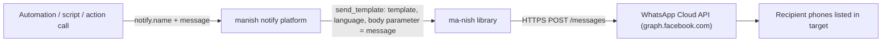

[](https://github.com/hacs/integration)
[](LICENSE)

# manish-custom-notifier

**manish-custom-notifier** is a Home Assistant custom integration that adds a `notify` service for sending WhatsApp notifications through the [WhatsApp Cloud API](https://developers.facebook.com/docs/whatsapp/cloud-api/get-started). It is a thin wrapper around [ma-nish](https://github.com/t0mer/ma-nish), a Python client for the WhatsApp Cloud API, and needs only a few lines in `configuration.yaml`.

Every notification is sent as a WhatsApp **template message**: the text you pass as `message` is inserted into the body variable of a template you create in WhatsApp Manager.

> **Unofficial project.** This integration is not affiliated with, endorsed by, or supported by Meta Platforms, Inc. or WhatsApp. "WhatsApp" and "Meta" are trademarks of their respective owners.

## Table of contents

- [Features](#features)
- [How it works](#how-it-works)
- [Limitations](#limitations)
- [Requirements](#requirements)
- [Getting started (Meta setup)](#getting-started)
- [Installation](#installation)
- [Configuration](#configuration)
- [Usage](#usage)
- [Troubleshooting](#troubleshooting)
- [Security and privacy](#security-and-privacy)
- [Known issues](#known-issues)
- [Contributing](#contributing)
- [License](#license)

## Features

- Adds a legacy `notify` platform named `manish`, which creates a `notify.<name>` action (service) in Home Assistant.
- Sends WhatsApp template messages through the official WhatsApp Cloud API (via the `ma-nish` library).
- Puts the notification text into the template's body variable (`{{1}}`), so one template can carry any message.
- Sends to one or more recipients: list several phone numbers in `target`, separated by commas.
- Configured in YAML; no extra services or containers to run.
- Available in the HACS default repository list.

## How it works



1. When Home Assistant loads the platform, the integration creates one `MaNish` client with your access token and phone number ID.
2. When the `notify.<name>` action is called, the integration loops over the configured recipients.
3. For each recipient, it builds a template `body` component with a single text parameter containing `message`, and calls ma-nish's `send_template()` with your configured `template` and `language`.
4. The API response is written to the Home Assistant log.

## Limitations

- Only **template** messages are sent. Plain free-form text messages, media, and documents are not supported by this integration.
- The template must have **exactly one** body variable (`{{1}}`) and no header variables. The integration only fills in the body.
- Recipients are fixed in `configuration.yaml`. The `target`, `title` and `data` fields of the action call are ignored (see [Usage](#usage)).
- You can't send messages to a WhatsApp group.
- WhatsApp Cloud API messaging is billed by Meta. See Meta's [WhatsApp Business Platform pricing](https://developers.facebook.com/docs/whatsapp/pricing) page for the current free tier and rates.
- With Meta's test phone number, you can only message recipients you have added and verified in the app's recipient list.

## Requirements

- Home Assistant with support for YAML-configured (legacy) `notify` platforms. No minimum Home Assistant version is declared in `hacs.json` or `manifest.json`. The usage examples below use the `action:` call syntax (Home Assistant 2024.8+) and the `triggers:`/`trigger:` automation syntax (2024.10+); see [Usage](#usage) for the older syntax.
- [HACS](https://hacs.xyz/) (recommended) or access to your Home Assistant `config` directory.
- A Meta developer account and a Meta **Business** app with the WhatsApp product enabled.
- From the WhatsApp product's **Getting started** (API setup) page:
  - an **access token** (the temporary token expires after 24 hours; generate a permanent token, for example with a System User, for long-term use);
  - the **Phone number ID** of the sending number.
- An approved **message template** with one body variable, and its language code.
- Outbound internet access from Home Assistant to `graph.facebook.com` (and to `analytics.techblog.co.il`, see [Security and privacy](#security-and-privacy)).
- The [`ma-nish`](https://pypi.org/project/ma-nish/) Python package. Home Assistant installs it automatically from the `requirements` in `manifest.json` (`ma-nish>=0.5.0`).

The ma-nish README has a detailed, step-by-step [Meta setup guide](https://github.com/t0mer/ma-nish#setting-up-the-environment) with screenshots.

## Getting started

First, follow the [instructions on this page](https://developers.facebook.com/docs/whatsapp/cloud-api/get-started) to:

- Register as a Meta developer
- Enable two-factor authentication for your account
- Create a Meta app (you need a **Business** app for WhatsApp)

Once you've done that, go to your app and set up the WhatsApp product.

[](https://techblog.co.il/wp-content/uploads/2022/12/new-app.png "New App")

You'll be given a temporary access token and a Phone number ID. Note these down, as you'll need them later. Set up your own phone number as a recipient, and you can have a go at sending yourself a test message:

[](https://techblog.co.il/wp-content/uploads/2022/12/test-number.png "Getting started")

### Set up a message template

In the test message above, you used the **hello_world** template. You'll need to set up your own template for your own purposes. Go to [Message Templates](https://business.facebook.com/wa/manage/message-templates/) in WhatsApp Manager to build your own templates.

In the following example, I created a template for my smart home. The template has no header and a fixed footer. The body has one `{{1}}` variable for the dynamic text:

[](https://techblog.co.il/wp-content/uploads/2022/12/my-template.png "Smart Home Template")

Note the template's **name** (for example `smart_home`) and its **language code** (for example `he` or `en_US`). You need both for the configuration. See Meta's [template message guide](https://developers.facebook.com/docs/whatsapp/cloud-api/guides/send-message-templates) for details.

Once you're done with the above, you're ready to start sending notifications using **manish**.

## Installation

### HACS (recommended)

manish is part of the HACS default repository list, where it is listed as **MaNish whatsapp custom notification / notify**.

1. In Home Assistant, open **HACS**.
2. Search for **MaNish whatsapp custom notification / notify** and open it.
3. Download it.
4. Add the [configuration](#configuration) to `configuration.yaml`.
5. Restart Home Assistant.

Before this repository was added to the HACS default list, you had to add it manually as a custom repository (`https://github.com/t0mer/manish-custom-notifier`, category **Integration**). This is no longer needed, but the screens are kept here for reference:

[](https://raw.githubusercontent.com/t0mer/manish-custom-notifier/main/screenshots/manish-notifier-add-hacs-repo.png "Add custom repository in HACS")

[](https://raw.githubusercontent.com/t0mer/manish-custom-notifier/main/screenshots/manish-new-repo.png "New repository in HACS")

[](https://raw.githubusercontent.com/t0mer/manish-custom-notifier/main/screenshots/manish-add-button.png "Integration page in HACS")

### Manual installation

1. Download the [latest release](https://github.com/t0mer/manish-custom-notifier/releases/latest) (or clone this repository).
2. Copy the `custom_components/manish` folder into your Home Assistant `config/custom_components/` directory, so you end up with `config/custom_components/manish/manifest.json`.
3. Add the [configuration](#configuration) to `configuration.yaml`.
4. Restart Home Assistant.

## Configuration

This integration is configured in YAML only; there is no UI setup. Add a `notify` entry to `configuration.yaml`:

```yaml
notify:
  - platform: manish
    name: MaNish whatsapp notifire
    target: "972500000000"          # Recipient number(s), digits only, no "+"; comma-separated for several
    token: !secret whatsapp_token   # WhatsApp Cloud API access token
    phone_number_id: !secret whatsapp_phone_number_id
    template: smart_home            # Name of your approved message template
    language: he                    # Language code of that template
```

And in `secrets.yaml`:

```yaml
whatsapp_token: "<your access token>"
whatsapp_phone_number_id: "<your phone number ID>"
```

| Key | Required | Default | Description |
|-----|----------|---------|-------------|
| `platform` | Yes | – | Must be `manish`. |
| `name` | No | `notify` | Name of the notifier. Home Assistant slugifies it to build the action name, for example `MaNish whatsapp notifire` becomes `notify.manish_whatsapp_notifire`. If omitted, the action is `notify.notify`. |
| `target` | Yes | – | Recipient phone number(s) in international format, digits only, without `+` or spaces (for example `972500000000`). For several recipients, separate them with commas and **no spaces**: `"972500000000,972511111111"`. Quote the value so YAML treats it as a string. |
| `token` | Yes | – | WhatsApp Cloud API access token. Use `!secret`. |
| `phone_number_id` | Yes | – | Phone number ID of the sending WhatsApp number (from the app's API setup page). Not the phone number itself. |
| `template` | Yes | – | Name of the approved message template to send. |
| `language` | Yes | – | Language code of the template (for example `en_US`, `he`). It must match a language the template is approved in. |
| `title` | No | – | Accepted by the configuration schema but currently not used when sending. |

All values are validated as strings. You can add several `- platform: manish` entries with different `name`, `template` or `target` values to create several notifiers.

Restart Home Assistant, and you should see a new action (service):

[](https://github.com/t0mer/manish-custom-notifier/blob/main/screenshots/manish-notification-service.png?raw=true "manish custom component")

## Usage

Call `notify.<name>` with a `message`. The message becomes the value of the template's body variable and is sent to every number in `target`.

| Action field | Used? | Notes |
|--------------|-------|-------|
| `message` | Yes | Text inserted into the template's body variable `{{1}}`. |
| `title` | No | Ignored. |
| `target` | No | Ignored. Recipients always come from `target` in `configuration.yaml`. |
| `data` | No | Ignored. Images, documents and other media are not supported. |

### Developer tools

In **Developer tools > Actions**, choose `notify.manish_whatsapp_notifire` (or your own name), then:

```yaml
action: notify.manish_whatsapp_notifire
data:
  message: "Hello from Home Assistant"
```

### Automation

```yaml
automation:
  - alias: "WhatsApp alert when the front door opens"
    triggers:
      - trigger: state
        entity_id: binary_sensor.front_door
        to: "on"
    actions:
      - action: notify.manish_whatsapp_notifire
        data:
          message: "The front door was opened at {{ now().strftime('%H:%M') }}"
```

### Script

```yaml
script:
  whatsapp_washer_done:
    alias: "WhatsApp: washing machine finished"
    sequence:
      - action: notify.manish_whatsapp_notifire
        data:
          message: "The washing machine has finished."
```

The `action:` call syntax needs Home Assistant 2024.8 or later, and the `triggers:`/`trigger:` automation syntax needs 2024.10 or later. On older versions, use `trigger:` with `platform: state` for triggers, and `action:` as the list key with `service:` for the calls (for example `- service: notify.manish_whatsapp_notifire`).

## Troubleshooting

- **The action doesn't appear.** Check that `custom_components/manish/` exists, that the `notify:` block is valid, and that you restarted Home Assistant. Look for configuration errors in **Settings > System > Logs**. All of `target`, `token`, `phone_number_id`, `template` and `language` are required.
- **Check the API response.** After every send, the integration logs the response from the WhatsApp Cloud API as a **warning** that starts with `Whatsapp:`. A successful response contains a `messages` entry; a failure contains an `error` object from Meta (or `{"error": ...}` if the request itself failed). This warning appears even when sending succeeds.
- **The message is rejected with a parameter error.** The template must have exactly one body variable and no header variables, because the integration sends exactly one body parameter.
- **Template or language not found.** `template` must be the template's exact name, and `language` must be a language that template is approved in.
- **It worked yesterday and stopped.** The temporary access token from the Getting started page expires after 24 hours. Use a permanent token.
- **Only some recipients get the message.** Make sure `target` has no spaces around the commas; spaces are not stripped. With the Meta test number, each recipient must be added and verified in your app.
- **More logs.** Log lines from the integration use the `custom_components.manish.notify` logger:

  ```yaml
  logger:
    default: warning
    logs:
      custom_components.manish: info
  ```

  The ma-nish library logs with `loguru` rather than Home Assistant's logger. Loguru writes to the process's stderr, so these messages appear in the container or add-on logs (for example `docker logs`), not in `home-assistant.log`. <!-- TODO: verify exact location on HA OS -->
- **Home Assistant is slow to start or the notifier hangs at setup.** Creating the ma-nish client makes an HTTP request without a timeout (see below). If your network silently drops traffic to `analytics.techblog.co.il`, setup can hang; block it with a rejecting rule instead.

## Security and privacy

- **Keep the access token in `secrets.yaml`** and reference it with [`!secret`](https://www.home-assistant.io/docs/configuration/secrets/). Don't commit it to a public repository or share it in screenshots or logs. Anyone with the token can send messages from your WhatsApp Business number.
- **Message content goes through Meta.** Notification text and recipient numbers are sent to the WhatsApp Cloud API (`graph.facebook.com`) and are processed under Meta's terms. Don't put sensitive information in notifications.
- **Logs contain message data.** At `info` level the integration logs each recipient and message text, and every API response (which includes recipient IDs) is logged as a warning.
- **Anonymous usage statistics.** The ma-nish library sends an anonymous HTTP `GET` request to a pixel on `analytics.techblog.co.il` every time a `MaNish` object is created. This integration creates one when each `manish` notifier is set up (at Home Assistant startup), so each startup triggers one request per configured notifier. According to the [ma-nish README](https://github.com/t0mer/ma-nish#usage-statistics), the request carries no message data, token or phone number, but the analytics server sees your IP address and user agent. There is no option to turn it off; if you need to, block the host at the DNS level or with a firewall rule that rejects the connection (a silently dropped connection makes the call hang, because it has no timeout).

## Known issues

- The `title`, `target` and `data` fields of the action call are ignored; only `message` is used.
- `title` is accepted in `configuration.yaml` but not used.
- The requirement `ma-nish>=0.5.0` has no upper bound, so Home Assistant installs the latest ma-nish release (1.3.2 at the time of writing), which also pulls in dependencies such as FastAPI, Uvicorn, Pillow and geopy. <!-- TODO: verify no conflicts with Home Assistant's pinned packages -->
- ma-nish calls a fixed Graph API version (`v15.0`). <!-- TODO: verify behaviour once Meta retires v15.0 -->
- ma-nish's send request (HTTP `POST`) has no timeout, so a stalled connection to the WhatsApp Cloud API can block the notification call.
- The error handler in `notify.py` refers to `self._target`, but only `self._targets` exists (`notify.py:59`). If an exception occurs inside the send loop, the handler itself raises `AttributeError`, the original error isn't logged, and the remaining recipients are skipped.
- This is a legacy YAML `notify` platform; it doesn't create `notify` entities and has no UI configuration.

## Contributing

Issues and pull requests are welcome at [github.com/t0mer/manish-custom-notifier](https://github.com/t0mer/manish-custom-notifier/issues).

- The integration lives in `custom_components/manish/` (`manifest.json`, `notify.py`, `services.yaml`).
- The GitHub Actions workflows run [HACS validation](.github/workflows/hacs.yml) and [hassfest](<.github/workflows/hassfest .yml>) on every push and pull request, and daily.
- For changes to the WhatsApp API client itself, see [ma-nish](https://github.com/t0mer/ma-nish).

## License

This project is licensed under the [MIT License](LICENSE). Copyright (c) 2023 Tomer Klein.
